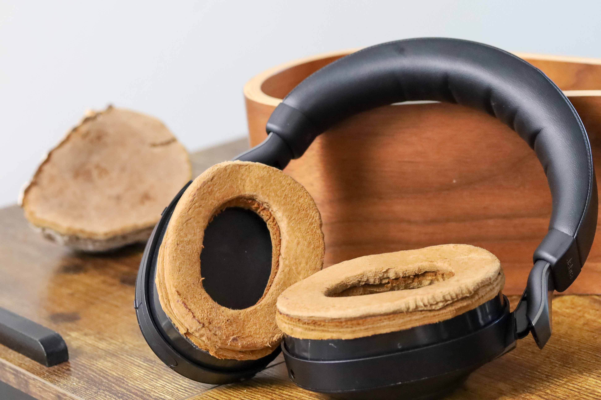

# TramaTech: Traditional Trama Meets Modern Technology

  

> Combining the ancient art of tinder fungus leather (amadou/trama) with modern audio technology for sustainable, comfortable, and naturally antimicrobial headphone modifications

  
   
  <em>Detailed view showing the natural texture and craftsmanship of trama ear cushions</em>

## 🍄 Project Overview

**TramaTech** demonstrates how traditional European fungal leather crafting can enhance modern technology. This DIY project replaces synthetic leather ear cushions on Jabra Elite 85h headphones and augments an orthopedic arm rest using amadou (trama) - a sustainable, breathable material made from *Fomes fomentarius* (tinder fungus).

### ✨ Key Benefits Achieved

- **Superior Comfort**: No more sweating during extended wear
- **Enhanced Sound Quality**: Improved acoustic properties  
- **Natural Warmth**: Comfortable temperature regulation
- **Sustainable Materials**: Using traditional, renewable resources
- **Quick Implementation**: ~1 hour build time

### ⚠️ Trade-offs

- **ANC Performance**: Slightly reduced Active Noise Cancellation seal
- **Aesthetic**: Unique, rustic appearance may not suit all preferences

## 📸 Gallery

| Headphones | Headphones |
|--------|--------|
|  |  |
| *Headphones with modification on stand* | *Close view on replaced cushions* | 

| Arm Rest  |  Arm Rest |
|-----------|-------|
|  |   |
| *Orthopedic arm rest with trama padding* | *Closeup Armrest with replaced cushions* |

## 🌍 Historical Background

### The Ancient Craft of Amadou

Amadou, also known as trama leather, has been crafted from the tinder fungus (*Fomes fomentarius*) for over 5,000 years. Archaeological evidence shows that Ötzi the Iceman carried amadou in 3,300 BCE for fire-starting and medicinal purposes.

### The Last Amadou Makers of Europe

Today, this traditional craft survives only in **Korond (Corund), Transylvania, Romania** (Harghita County), where seven families maintain the ancient techniques of "taplászat" (the local term for amadou-making). This community represents the last active amadou craftsmen in Europe, preserving knowledge passed down since the 1860s.

Learn more: [The World's Last Amadou Makers](https://medium.com/@istvan.daraban/the-worlds-last-amadou-makers-korond-iii-9694114ffa4a)

## 🛠️ Quick Start Guide

### Time Required
- Preparation: 15 minutes
- Modification: 45 minutes
- Total: ~1 hour

### Difficulty Level
⭐⭐⭐☆☆ (Intermediate - requires careful cutting and gluing)

### What You'll Need

#### Materials
- **Amadou/Trama sheets** (10x10cm minimum)
  - Purchase directly from [my source](https://www.etsy.com/de-en/listing/802350229/amadou-pieces-fly-fishing) or [Korond craftsmen](https://www.facebook.com/AmadouTransylvania/) 
- **Knöfix glue** or similar leather adhesive
- **Jabra Elite 85h headphones** (or similar over-ear model)
- Optional: Orthopedic arm rest for second project

#### Tools
- Sharp craft knife or scalpel
- Small hammer for flattening
- Cutting mat
- Ruler or template
- Fine sandpaper (optional)
- Isopropyl alcohol for cleaning

### Construction Technique

**Two-Layer Trama Design**: This modification uses a dual-layer approach for optimal comfort and durability:
- **Middle Layer**: Harder trama piece positioned between the plastic cushion element and top layer
- **Top Layer**: Especially soft trama for direct skin contact
- Both layers are bonded together using a small amount of Knöfix glue

### Basic Steps

1. **Remove Original Cushions**: Carefully detach synthetic leather from headphones
2. **Create Templates**: Trace original cushion shapes onto paper
3. **Cut Trama**: Use templates to cut both hard and soft amadou sheets precisely
4. **Layer Assembly**: Apply thin layer of Knöfix between trama pieces
5. **Prepare Surface**: Clean adhesive areas with isopropyl alcohol
6. **Apply Adhesive**: Use Knöfix glue sparingly on both surfaces
7. **Attach & Shape**: Position layered trama, hammer gently for adhesion
8. **Finishing Touches**: Trim excess with sharp knife

📖 **[Detailed Build Instructions →](docs/BUILD_GUIDE.md)**

## 📚 Documentation

- 📖 [**Complete Build Guide**](docs/BUILD_GUIDE.md) - Step-by-step instructions with photos
- 🧪 [**Materials Science**](docs/MATERIALS.md) - Understanding amadou properties
- 🔧 [**Troubleshooting**](docs/TROUBLESHOOTING.md) - Common issues and solutions
- 🌿 [**Sustainability Notes**](docs/SUSTAINABILITY.md) - Environmental impact and ethics
- 📜 [**Traditional Techniques**](docs/TRADITIONAL_CRAFT.md) - Historical methods and cultural significance

## 🔬 Technical Specifications

### Jabra Elite 85h (Base Hardware)
- **Drivers**: 40mm custom-tuned
- **ANC**: Digital Hybrid (8 microphones)
- **Battery**: 36 hours with ANC
- **Bluetooth**: 5.0 with AAC support
- **Water Resistance**: IP52 rated

### Trama Material Properties
- **Thickness**: 2-4mm (adjustable through processing)
- **Density**: 0.3-0.5 g/cm³
- **Thermal Conductivity**: Low (excellent insulation)
- **Moisture Management**: Superior wicking properties
- **Antimicrobial**: Natural fungal resistance

## 📖 References & Resources

### Scientific Literature
- Peintner, U., et al. (2019). "The Ice Man's fungi: Facts and mysteries." *International Journal of Medicinal Mushrooms*
- Papp, N., et al. (2017). "Ethnomycological use of *Fomes fomentarius* in Transylvania, Romania." *Genetic Resources and Crop Evolution*

### Traditional Craft Resources
- [Amadou Products Blog](https://amadouproducts.blogspot.com/) - Traditional techniques
- [Korond Amadou Makers](https://www.facebook.com/AmadouTransylvania/) - Direct from craftsmen
- [Fungus Federation of Santa Cruz](https://ffsc.us/MOM%5CFomes_fomentarius) - Mycological information
- [Premium hand crafted Amadou hats and materials](https://www.etsy.com/shop/amadoustore)

### Technical Guides
- [Primitive Ways: Amadou Substitutes](https://www.primitiveways.com/Amadou%20substitutes.html)
- [Practical Self Reliance: Foraging Fomes](https://practicalselfreliance.com/fomes-fomentarius/)
- [Beaver Bushcraft: Making Amadou](https://www.beaverbushcraft.co.uk/page_4140610.html)

### Related Projects
- [Mycelium Materials Research](https://www.mycoworks.com/)
- [DIY Headphone Mods Community](https://www.head-fi.org/forums/diy-do-it-yourself-discussions.6/)
- [Sustainable Audio Initiative](https://sustainableaudio.org/)

## 🤝 Contributing

This is an open-source DIY project! Contributions are welcome:

- 🐛 Report issues or suggest improvements
- 📸 Share your build photos and modifications
- 📝 Improve documentation or translations
- 🔬 Add technical measurements or acoustic tests

See [CONTRIBUTING.md](CONTRIBUTING.md) for guidelines.

## 📜 License

This project is licensed under the [Creative Commons Attribution-NonCommercial-ShareAlike 4.0 International License](https://creativecommons.org/licenses/by-nc-sa/4.0/).

You are free to:
- **Share** — copy and redistribute the material
- **Adapt** — remix, transform, and build upon the material

## 🙏 Acknowledgments

- The amadou craftsmen of Korond, Transylvania for preserving this ancient art
- Jabra for creating modifiable, high-quality headphones
- The mycology community for research and knowledge sharing
- Traditional knowledge keepers across Europe

## 📬 Contact

Questions? Ideas? Show us your build!

- Open an [Issue](https://github.com/barde/TramaTech/issues)
- Tag us: #TramaTech #AmadouAudio #SustainableSound

---

**Made with 🍄 and traditional wisdom**

*Bridging 5,000 years of craft with modern technology*

**Project by:** Bartholomäus Dedersen  
**Created:** 2025

