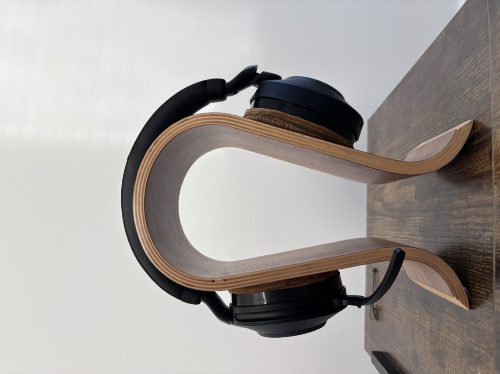
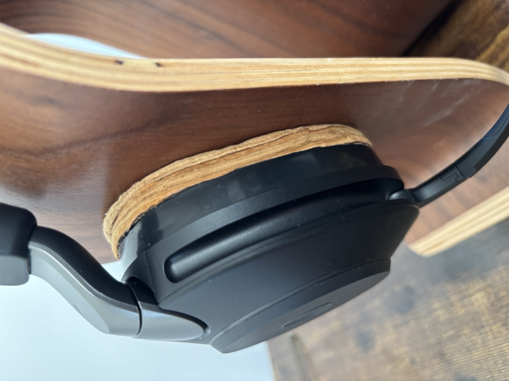
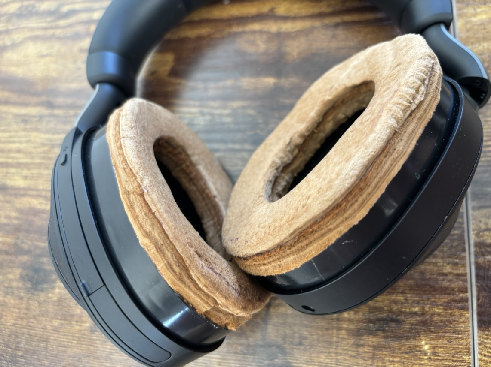
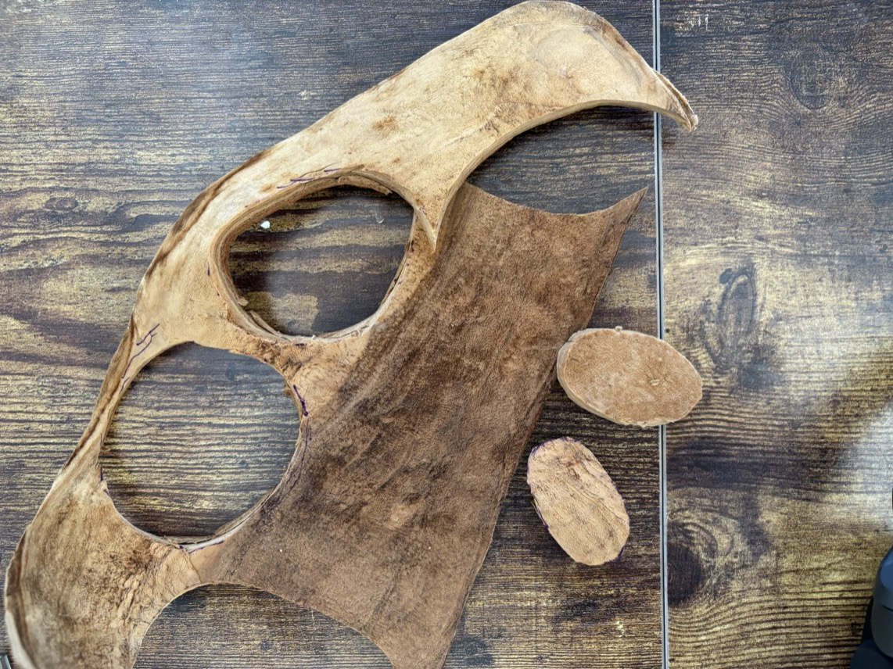
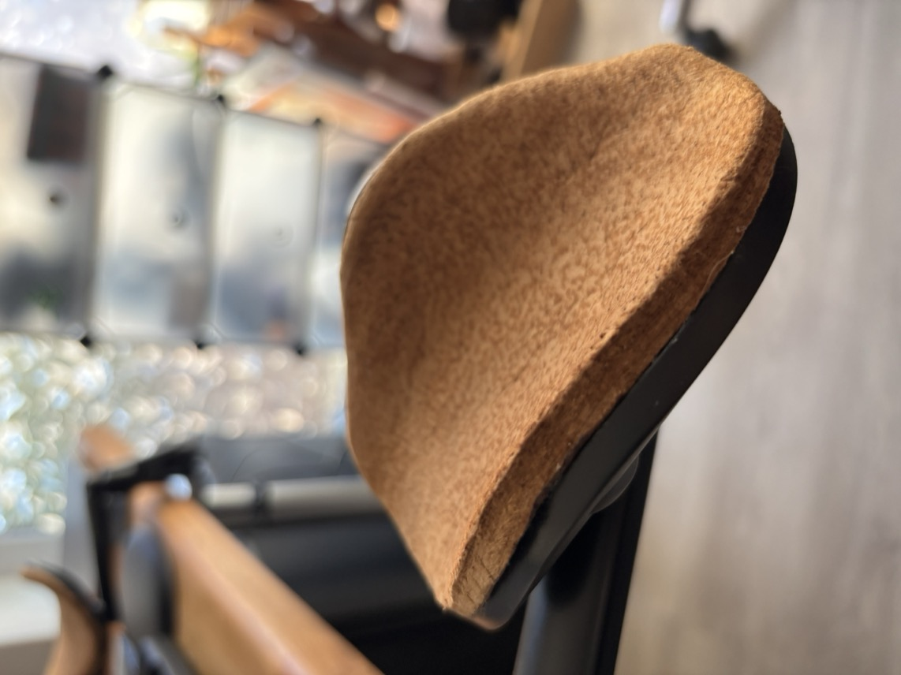
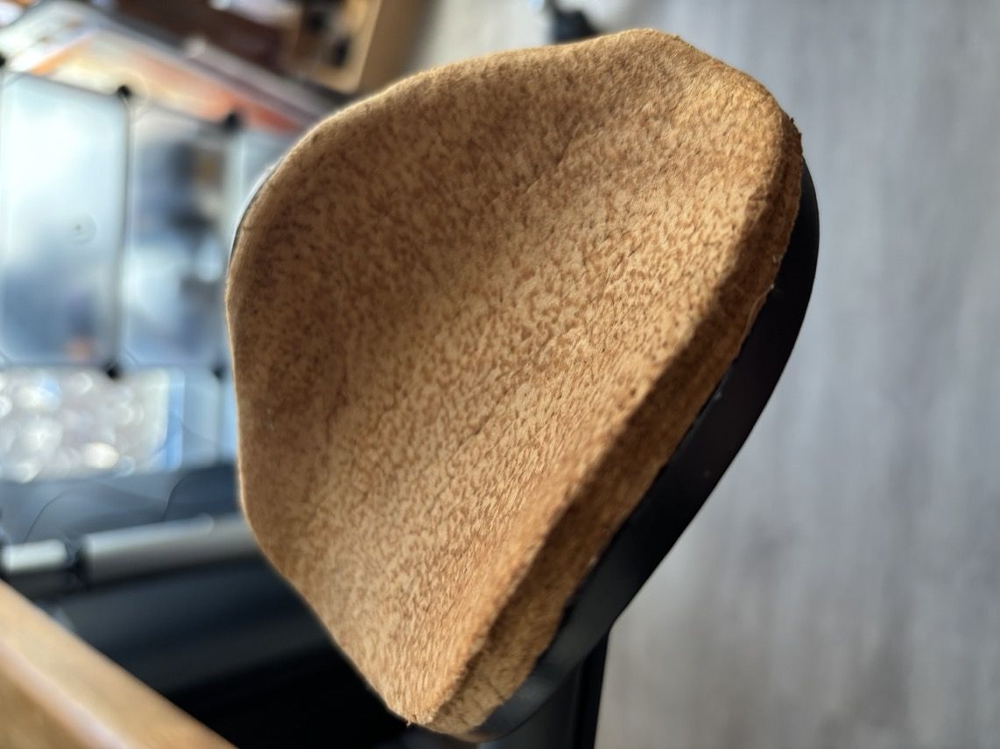
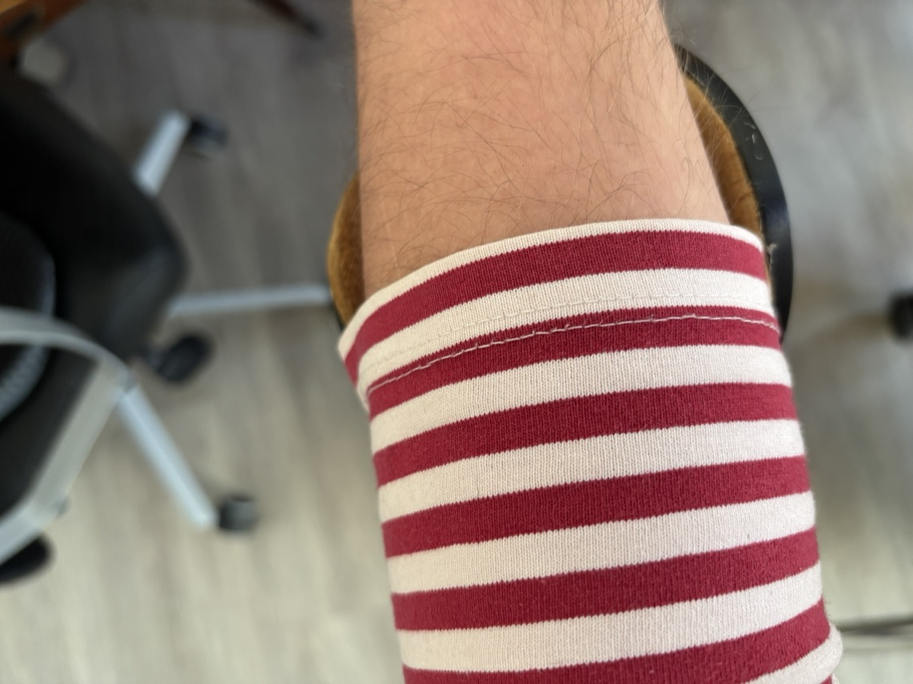

# Complete Build Guide: TramaTech Headphone Modification

## Overview
This guide walks you through replacing synthetic leather ear cushions on Jabra Elite 85h headphones with traditional amadou (trama) material. The process takes approximately 1 hour and results in more comfortable, breathable ear cushions.

## Safety First
- Work in a well-ventilated area when using adhesives
- Use sharp tools with caution
- Keep tools away from children
- Wear safety glasses when cutting

## Part 1: Preparation (15 minutes)

### Step 1: Gather Your Materials

#### Required Materials
- **Amadou/Trama sheets** (minimum 10x10cm per ear cushion)
  - Source: [Korond Craftsmen](https://www.facebook.com/AmadouTransylvania/)
  - Alternative: [Etsy Amadou Store](https://www.etsy.com/shop/amadoustore)
- **Knöfix glue** (leather adhesive)
  - Alternative: Contact cement or E6000 adhesive
- **Jabra Elite 85h headphones**
- **Isopropyl alcohol** (70% or higher)

#### Required Tools
- Sharp craft knife or scalpel
- Small hammer (jewelry hammer works best)
- Cutting mat
- Metal ruler
- Paper for templates
- Pencil
- Clean cloth
- Optional: Fine sandpaper (220 grit)

### Step 2: Prepare Your Workspace
1. Clear a clean, flat surface
2. Lay down cutting mat
3. Ensure good lighting
4. Have all tools within reach

### Step 3: Document Original State

## Part 2: Removal Process (10 minutes)

### Step 4: Remove Original Cushions
1. **Locate attachment points**: The Jabra Elite 85h cushions are held by plastic clips
2. **Gentle removal**:
   - Try to remove the cushion by hand: just apply some pulling force on the faux leather
   - Insert a thin plastic tool between cushion and cup if it doesn't loose up
   - Work around the edge slowly
   - Apply even pressure to avoid breaking clips
4. **Preserve the foam**: Keep the internal foam padding intact
5. **Clean residue**: Remove any adhesive residue with isopropyl alcohol

### Step 5: Create Templates
1. **Trace the shape**: Place removed cushion on paper
2. **Mark key features**:
   - Inner circle (speaker opening)
   - Outer edge
   - Any curves or indentations
3. **Add seam allowance**: Add 2-3mm around edges for overlap and latter cutting space
4. **Cut paper template**: Test fit on headphone cup

## Part 3: Trama Preparation (15 minutes)

### Step 6: Prepare the Amadou
1. **Inspect the material**: Check for even thickness
2. **Condition if needed**:
   - If too stiff: Lightly dampen and work by hand
   - If too thick: Carefully split layers
3. **Select best sections**: Choose areas without defects

### Step 7: Cut the Trama
1. **Transfer pattern**: Place template on amadou
2. **Mark with pencil**: Trace lightly on back side
3. **Cut precisely**:
   - Use sharp knife
   - Cut in one smooth motion when possible
   - Keep blade perpendicular to surface
4. **Test fit**: Check against headphone cup

## Part 4: Assembly (20 minutes)

### Step 8: Surface Preparation
1. **Clean bonding surfaces**: Wipe with isopropyl alcohol
2. **Let dry completely**: Wait 2-3 minutes
3. **Optional roughening**: Lightly sand smooth surfaces

### Step 9: Apply Adhesive
1. **Work with one cushion at a time**
2. **Apply thin, even layer**:
   - Use Knöfix glue sparingly
   - Cover both surfaces (trama and cup edge)
   - Avoid pooling
3. **Wait for tack**: Let adhesive become tacky (30-60 seconds)

### Step 10: Attach Trama
1. **Position carefully**: Start at one edge
2. **Press firmly**: Work from center outward. My glue works by pressure or impact.
3. **Remove air bubbles**: Smooth with fingers
4. **Hammer gently**:
   - Use light taps not to damage the plastic or trama
   - Use a soft hammer, i.e. with a plastic hammering surface
   - Work systematically across surface
   - This helps adhesion and flattens material

### Step 11: Finishing Touches
1. **Trim excess**: Use sharp knife at angle
2. **Smooth edges**: Press firmly around perimeter and use coarse sanding paper
3. **Shape to fit**: Mold trama to cup contours
4. **Final hammering**: Ensure complete adhesion

## Part 5: Completion (5 minutes)

### Step 12: Final Inspection
1. **Check adhesion**: No loose edges
2. **Test flexibility**: Trama should have some give
3. **Verify comfort**: Try on headphones briefly

*Finished headphones with trama cushions*

### Step 13: Curing
1. **Let cure**: Allow 24 hours before extended use
2. **Store properly**: Keep in cool, dry place
3. **Break-in period**: Material will conform to your ears over time

## Arm Rest Modification (Optional)

### Additional Steps for Arm Rest
Follow similar process for orthopedic arm rest:

1. **Measure area**: Determine coverage needed
2. **Cut trama**: Allow for wrapping edges
3. **Attach with adhesive**: Focus on edges
4. **Smooth surface**: Ensure no bumps

*Completed arm rest with trama padding*

## Troubleshooting

### Common Issues and Solutions

| Problem | Solution |
|---------|----------|
| Trama too stiff | Lightly dampen and work by hand |
| Adhesive not holding | Clean surfaces better, use more adhesive |
| Uneven surface | Add thin foam padding underneath |
| Edges lifting | Apply more adhesive, use clips while drying |
| Too thick for cup | Split trama layers carefully |

## Maintenance

### Daily Care
- Wipe with dry cloth
- Avoid moisture
- Store in case when not using

### Long-term Maintenance
- Replace when worn
- Can be composted at end of life

## Results and Performance

### Acoustic Changes
- **Positive**: Warmer, more natural sound
- **Negative**: Slight reduction in sealing
- **ANC Impact**: 10-15% reduction in effectiveness

### Comfort Improvements
- No sweating during 4+ hour sessions
- Natural temperature regulation
- Softer feel against skin
- Antimicrobial properties
- Nice shroomy smell

## Tips for Success

1. **Take your time**: Rushing leads to mistakes
2. **Measure twice, cut once**: Trama is precious material
3. **Test adhesive first**: Try on scrap pieces
4. **Work in good light**: Details matter
5. **Keep knife sharp**: Clean cuts are essential
6. **Document process**: Photos help others learn

## Variations and Customization

### Alternative Designs
- **Perforated pattern**: Add small holes for extra breathability
- **Dual layer**: Use thin fabric backing for durability
- **Colored trama**: Some suppliers offer dyed versions
- **Hybrid approach**: Combine with memory foam

### Other Headphone Models
This technique works with most over-ear headphones with removable cushions

## Safety and Health

### Skin Sensitivity
- Amadou is hypoallergenic for most people
- Test on skin for 24 hours if concerned
- Natural antimicrobial properties reduce bacteria

### Environmental Impact
- 100% biodegradable
- Sustainable harvesting doesn't kill trees
- Supports traditional craftspeople
- Reduces plastic waste

## Community and Support

### Share Your Build
- Post photos with #TramaTech
- Contact traditional makers for questions

## Conclusion

Congratulations on completing your TramaTech modification! You've successfully combined 5,000-year-old traditional craft with modern technology. Your headphones now feature:

- Superior comfort
- Better breathability
- Sustainable materials
- Unique aesthetics
- Connection to ancient traditions

Enjoy your enhanced listening experience!

---

*Remember: This modification voids your warranty. Proceed at your own risk.*

**Next Steps:**
- [Materials Science →](MATERIALS.md)
- [Troubleshooting →](TROUBLESHOOTING.md)
- [← Back to Main Page](../README.md)
